<style>
.small-code pre code {
  font-size: 1em;
}
</style>


Graph Types
========================================================
author: QUARC data visualization workshop


========================================================
type: section


Graphing by hand
========================================================
type: section

But...why?


How would you graph this?
========================================================

Number of emergency department visits due to energy drink consumption.

<!-- html table generated in R 3.6.0 by xtable 1.8-4 package -->
<!-- Tue Jun 18 16:32:03 2019 -->
<table border=1>
<tr> <th> Year </th> <th> Number of ED visits </th>  </tr>
  <tr> <td align="right"> 2007 </td> <td align="right"> 10056 </td> </tr>
  <tr> <td align="right"> 2009 </td> <td align="right"> 13110 </td> </tr>
  <tr> <td align="right"> 2011 </td> <td align="right"> 20132 </td> </tr>
   </table>

<footer style="font-size:20px">
(2011 SAMHSA.GOV)
</footer>

========================================================

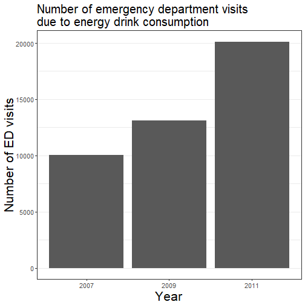


========================================================

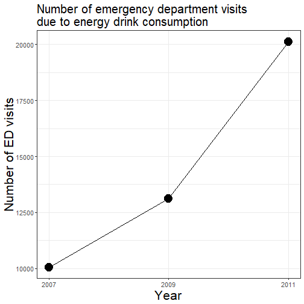


How about this?
========================================================

Number of days energy drinks are consumed (in last 30 days) and score on Perceived Stress Scale.

<!-- html table generated in R 3.6.0 by xtable 1.8-4 package -->
<!-- Tue Jun 18 16:32:04 2019 -->
<table border=1>
<tr> <th> Number of energy drinks in last 30 days </th> <th> Score on PSS </th>  </tr>
  <tr> <td align="right">   2 </td> <td align="right">  20 </td> </tr>
  <tr> <td align="right">   1 </td> <td align="right">  30 </td> </tr>
  <tr> <td align="right">  10 </td> <td align="right">  31 </td> </tr>
  <tr> <td align="right">   2 </td> <td align="right">  17 </td> </tr>
  <tr> <td align="right">   4 </td> <td align="right">  34 </td> </tr>
   </table>

<footer style="font-size:20px">
(Pettit & DeBarr, 2011)
</footer>


========================================================

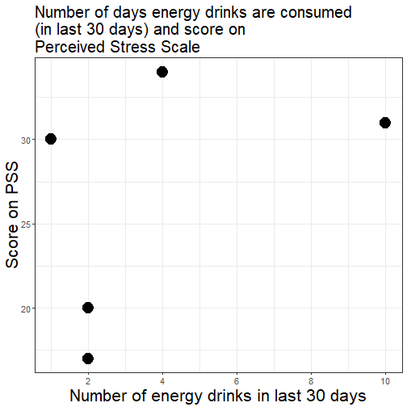


And this?
========================================================

Emergency department visits due to adverse reactions from or abuse/misuse of energy drinks.

<!-- html table generated in R 3.6.0 by xtable 1.8-4 package -->
<!-- Tue Jun 18 16:32:04 2019 -->
<table border=1>
<tr> <th> Year </th> <th> ED visits due to adverse reactions </th> <th> ED visits due to abuse/misuse </th>  </tr>
  <tr> <td> 2007 </td> <td align="right"> 6996 </td> <td align="right"> 3060 </td> </tr>
  <tr> <td> 2009 </td> <td align="right"> 8798 </td> <td align="right"> 4312 </td> </tr>
  <tr> <td> 2011 </td> <td align="right"> 14042 </td> <td align="right"> 6090 </td> </tr>
   </table>

<footer style="font-size:20px">
(2011 SAMHSA.GOV)
</footer>


========================================================

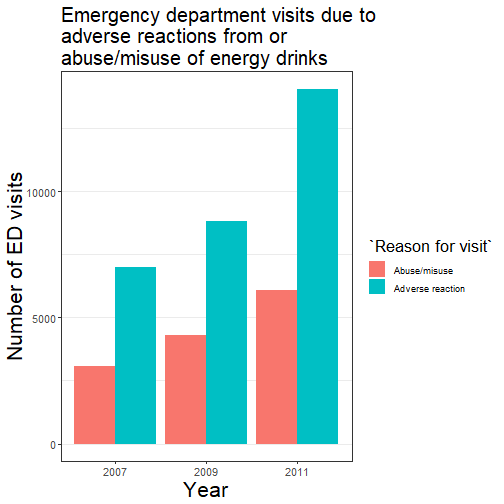


========================================================

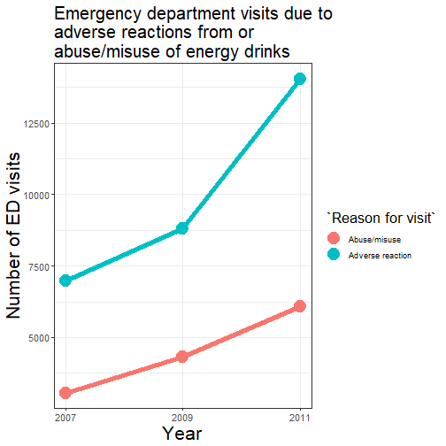


Data preparation
========================================================
type: section

Data preparation
========================================================
transition: none

Make sure you're data is "tidy":

* Observations are rows.
* Variables are columns.
* First row (and only first row) consists of variable names.
* No extra stuff outside the rectangle.


Identifying variable types
========================================================
type: section

Identifying variable types
========================================================
transition: none

* Categorical (nominal, qualitative, factor)

Classifies data by category.

> color, species, sex

* Quantitative (numeric, scale, interval/ratio)

Numerical measurements, usually with meaningful units.

> height, GDP, score


Identifying variable types
========================================================
transition: none

**CAREFUL!**

Numbers are not always quantitative.

> *Do you own a car?*
>> 0 = "No", 1 = "Yes"

> *What is your zip code?*


Data set
========================================================
type: section

Risk factors associated with low infant birth weight, collected at Baystate Medical Center, Springfield, Mass during 1986.

189 women measured on 10 variables.

Data set
========================================================
transition: none

<!-- html table generated in R 3.6.0 by xtable 1.8-4 package -->
<!-- Tue Jun 18 16:32:05 2019 -->
<table border=1>
<tr> <th> low </th> <th> age </th> <th> lwt </th> <th> race </th> <th> smoke </th> <th> ptl </th> <th> ht </th> <th> ui </th> <th> ftv </th> <th> bwt </th>  </tr>
  <tr> <td align="right">   0 </td> <td align="right">  19 </td> <td align="right"> 182 </td> <td align="right">   2 </td> <td align="right">   0 </td> <td align="right">   0 </td> <td align="right">   0 </td> <td align="right">   1 </td> <td align="right">   0 </td> <td align="right"> 2523 </td> </tr>
  <tr> <td align="right">   0 </td> <td align="right">  33 </td> <td align="right"> 155 </td> <td align="right">   3 </td> <td align="right">   0 </td> <td align="right">   0 </td> <td align="right">   0 </td> <td align="right">   0 </td> <td align="right">   3 </td> <td align="right"> 2551 </td> </tr>
  <tr> <td align="right">   0 </td> <td align="right">  20 </td> <td align="right"> 105 </td> <td align="right">   1 </td> <td align="right">   1 </td> <td align="right">   0 </td> <td align="right">   0 </td> <td align="right">   0 </td> <td align="right">   1 </td> <td align="right"> 2557 </td> </tr>
  <tr> <td align="right">   0 </td> <td align="right">  21 </td> <td align="right"> 108 </td> <td align="right">   1 </td> <td align="right">   1 </td> <td align="right">   0 </td> <td align="right">   0 </td> <td align="right">   1 </td> <td align="right">   2 </td> <td align="right"> 2594 </td> </tr>
  <tr> <td align="right">   0 </td> <td align="right">  18 </td> <td align="right"> 107 </td> <td align="right">   1 </td> <td align="right">   1 </td> <td align="right">   0 </td> <td align="right">   0 </td> <td align="right">   1 </td> <td align="right">   0 </td> <td align="right"> 2600 </td> </tr>
  <tr> <td align="right">   0 </td> <td align="right">  21 </td> <td align="right"> 124 </td> <td align="right">   3 </td> <td align="right">   0 </td> <td align="right">   0 </td> <td align="right">   0 </td> <td align="right">   0 </td> <td align="right">   0 </td> <td align="right"> 2622 </td> </tr>
  <tr> <td align="right">   0 </td> <td align="right">  22 </td> <td align="right"> 118 </td> <td align="right">   1 </td> <td align="right">   0 </td> <td align="right">   0 </td> <td align="right">   0 </td> <td align="right">   0 </td> <td align="right">   1 </td> <td align="right"> 2637 </td> </tr>
  <tr> <td align="right">   0 </td> <td align="right">  17 </td> <td align="right"> 103 </td> <td align="right">   3 </td> <td align="right">   0 </td> <td align="right">   0 </td> <td align="right">   0 </td> <td align="right">   0 </td> <td align="right">   1 </td> <td align="right"> 2637 </td> </tr>
  <tr> <td align="right">   0 </td> <td align="right">  29 </td> <td align="right"> 123 </td> <td align="right">   1 </td> <td align="right">   1 </td> <td align="right">   0 </td> <td align="right">   0 </td> <td align="right">   0 </td> <td align="right">   1 </td> <td align="right"> 2663 </td> </tr>
  <tr> <td align="right">   0 </td> <td align="right">  26 </td> <td align="right"> 113 </td> <td align="right">   1 </td> <td align="right">   1 </td> <td align="right">   0 </td> <td align="right">   0 </td> <td align="right">   0 </td> <td align="right">   0 </td> <td align="right"> 2665 </td> </tr>
  <tr> <td align="right">   0 </td> <td align="right">  19 </td> <td align="right">  95 </td> <td align="right">   3 </td> <td align="right">   0 </td> <td align="right">   0 </td> <td align="right">   0 </td> <td align="right">   0 </td> <td align="right">   0 </td> <td align="right"> 2722 </td> </tr>
  <tr> <td align="right">   0 </td> <td align="right">  19 </td> <td align="right"> 150 </td> <td align="right">   3 </td> <td align="right">   0 </td> <td align="right">   0 </td> <td align="right">   0 </td> <td align="right">   0 </td> <td align="right">   1 </td> <td align="right"> 2733 </td> </tr>
  <tr> <td align="right">   0 </td> <td align="right">  22 </td> <td align="right">  95 </td> <td align="right">   3 </td> <td align="right">   0 </td> <td align="right">   0 </td> <td align="right">   1 </td> <td align="right">   0 </td> <td align="right">   0 </td> <td align="right"> 2751 </td> </tr>
  <tr> <td align="right">   0 </td> <td align="right">  30 </td> <td align="right"> 107 </td> <td align="right">   3 </td> <td align="right">   0 </td> <td align="right">   1 </td> <td align="right">   0 </td> <td align="right">   1 </td> <td align="right">   2 </td> <td align="right"> 2750 </td> </tr>
  <tr> <td align="right">   0 </td> <td align="right">  18 </td> <td align="right"> 100 </td> <td align="right">   1 </td> <td align="right">   1 </td> <td align="right">   0 </td> <td align="right">   0 </td> <td align="right">   0 </td> <td align="right">   0 </td> <td align="right"> 2769 </td> </tr>
  <tr> <td align="right">   0 </td> <td align="right">  18 </td> <td align="right"> 100 </td> <td align="right">   1 </td> <td align="right">   1 </td> <td align="right">   0 </td> <td align="right">   0 </td> <td align="right">   0 </td> <td align="right">   0 </td> <td align="right"> 2769 </td> </tr>
  <tr> <td align="right">   0 </td> <td align="right">  15 </td> <td align="right">  98 </td> <td align="right">   2 </td> <td align="right">   0 </td> <td align="right">   0 </td> <td align="right">   0 </td> <td align="right">   0 </td> <td align="right">   0 </td> <td align="right"> 2778 </td> </tr>
  <tr> <td align="right">   0 </td> <td align="right">  25 </td> <td align="right"> 118 </td> <td align="right">   1 </td> <td align="right">   1 </td> <td align="right">   0 </td> <td align="right">   0 </td> <td align="right">   0 </td> <td align="right">   3 </td> <td align="right"> 2782 </td> </tr>
  <tr> <td align="right">   0 </td> <td align="right">  20 </td> <td align="right"> 120 </td> <td align="right">   3 </td> <td align="right">   0 </td> <td align="right">   0 </td> <td align="right">   0 </td> <td align="right">   1 </td> <td align="right">   0 </td> <td align="right"> 2807 </td> </tr>
  <tr> <td align="right">   0 </td> <td align="right">  28 </td> <td align="right"> 120 </td> <td align="right">   1 </td> <td align="right">   1 </td> <td align="right">   0 </td> <td align="right">   0 </td> <td align="right">   0 </td> <td align="right">   1 </td> <td align="right"> 2821 </td> </tr>
  <tr> <td align="right">   0 </td> <td align="right">  32 </td> <td align="right"> 121 </td> <td align="right">   3 </td> <td align="right">   0 </td> <td align="right">   0 </td> <td align="right">   0 </td> <td align="right">   0 </td> <td align="right">   2 </td> <td align="right"> 2835 </td> </tr>
  <tr> <td align="right">   0 </td> <td align="right">  31 </td> <td align="right"> 100 </td> <td align="right">   1 </td> <td align="right">   0 </td> <td align="right">   0 </td> <td align="right">   0 </td> <td align="right">   1 </td> <td align="right">   3 </td> <td align="right"> 2835 </td> </tr>
  <tr> <td align="right">   0 </td> <td align="right">  36 </td> <td align="right"> 202 </td> <td align="right">   1 </td> <td align="right">   0 </td> <td align="right">   0 </td> <td align="right">   0 </td> <td align="right">   0 </td> <td align="right">   1 </td> <td align="right"> 2836 </td> </tr>
  <tr> <td align="right">   0 </td> <td align="right">  28 </td> <td align="right"> 120 </td> <td align="right">   3 </td> <td align="right">   0 </td> <td align="right">   0 </td> <td align="right">   0 </td> <td align="right">   0 </td> <td align="right">   0 </td> <td align="right"> 2863 </td> </tr>
  <tr> <td align="right">   0 </td> <td align="right">  25 </td> <td align="right"> 120 </td> <td align="right">   3 </td> <td align="right">   0 </td> <td align="right">   0 </td> <td align="right">   0 </td> <td align="right">   1 </td> <td align="right">   2 </td> <td align="right"> 2877 </td> </tr>
  <tr> <td align="right">   0 </td> <td align="right">  28 </td> <td align="right"> 167 </td> <td align="right">   1 </td> <td align="right">   0 </td> <td align="right">   0 </td> <td align="right">   0 </td> <td align="right">   0 </td> <td align="right">   0 </td> <td align="right"> 2877 </td> </tr>
  <tr> <td align="right">   0 </td> <td align="right">  17 </td> <td align="right"> 122 </td> <td align="right">   1 </td> <td align="right">   1 </td> <td align="right">   0 </td> <td align="right">   0 </td> <td align="right">   0 </td> <td align="right">   0 </td> <td align="right"> 2906 </td> </tr>
  <tr> <td align="right">   0 </td> <td align="right">  29 </td> <td align="right"> 150 </td> <td align="right">   1 </td> <td align="right">   0 </td> <td align="right">   0 </td> <td align="right">   0 </td> <td align="right">   0 </td> <td align="right">   2 </td> <td align="right"> 2920 </td> </tr>
  <tr> <td align="right">   0 </td> <td align="right">  26 </td> <td align="right"> 168 </td> <td align="right">   2 </td> <td align="right">   1 </td> <td align="right">   0 </td> <td align="right">   0 </td> <td align="right">   0 </td> <td align="right">   0 </td> <td align="right"> 2920 </td> </tr>
  <tr> <td align="right">   0 </td> <td align="right">  17 </td> <td align="right"> 113 </td> <td align="right">   2 </td> <td align="right">   0 </td> <td align="right">   0 </td> <td align="right">   0 </td> <td align="right">   0 </td> <td align="right">   1 </td> <td align="right"> 2920 </td> </tr>
  <tr> <td align="right">   0 </td> <td align="right">  17 </td> <td align="right"> 113 </td> <td align="right">   2 </td> <td align="right">   0 </td> <td align="right">   0 </td> <td align="right">   0 </td> <td align="right">   0 </td> <td align="right">   1 </td> <td align="right"> 2920 </td> </tr>
  <tr> <td align="right">   0 </td> <td align="right">  24 </td> <td align="right">  90 </td> <td align="right">   1 </td> <td align="right">   1 </td> <td align="right">   1 </td> <td align="right">   0 </td> <td align="right">   0 </td> <td align="right">   1 </td> <td align="right"> 2948 </td> </tr>
  <tr> <td align="right">   0 </td> <td align="right">  35 </td> <td align="right"> 121 </td> <td align="right">   2 </td> <td align="right">   1 </td> <td align="right">   1 </td> <td align="right">   0 </td> <td align="right">   0 </td> <td align="right">   1 </td> <td align="right"> 2948 </td> </tr>
  <tr> <td align="right">   0 </td> <td align="right">  25 </td> <td align="right"> 155 </td> <td align="right">   1 </td> <td align="right">   0 </td> <td align="right">   0 </td> <td align="right">   0 </td> <td align="right">   0 </td> <td align="right">   1 </td> <td align="right"> 2977 </td> </tr>
  <tr> <td align="right">   0 </td> <td align="right">  25 </td> <td align="right"> 125 </td> <td align="right">   2 </td> <td align="right">   0 </td> <td align="right">   0 </td> <td align="right">   0 </td> <td align="right">   0 </td> <td align="right">   0 </td> <td align="right"> 2977 </td> </tr>
  <tr> <td align="right">   0 </td> <td align="right">  29 </td> <td align="right"> 140 </td> <td align="right">   1 </td> <td align="right">   1 </td> <td align="right">   0 </td> <td align="right">   0 </td> <td align="right">   0 </td> <td align="right">   2 </td> <td align="right"> 2977 </td> </tr>
  <tr> <td align="right">   0 </td> <td align="right">  19 </td> <td align="right"> 138 </td> <td align="right">   1 </td> <td align="right">   1 </td> <td align="right">   0 </td> <td align="right">   0 </td> <td align="right">   0 </td> <td align="right">   2 </td> <td align="right"> 2977 </td> </tr>
  <tr> <td align="right">   0 </td> <td align="right">  27 </td> <td align="right"> 124 </td> <td align="right">   1 </td> <td align="right">   1 </td> <td align="right">   0 </td> <td align="right">   0 </td> <td align="right">   0 </td> <td align="right">   0 </td> <td align="right"> 2922 </td> </tr>
  <tr> <td align="right">   0 </td> <td align="right">  31 </td> <td align="right"> 215 </td> <td align="right">   1 </td> <td align="right">   1 </td> <td align="right">   0 </td> <td align="right">   0 </td> <td align="right">   0 </td> <td align="right">   2 </td> <td align="right"> 3005 </td> </tr>
  <tr> <td align="right">   0 </td> <td align="right">  33 </td> <td align="right"> 109 </td> <td align="right">   1 </td> <td align="right">   1 </td> <td align="right">   0 </td> <td align="right">   0 </td> <td align="right">   0 </td> <td align="right">   1 </td> <td align="right"> 3033 </td> </tr>
  <tr> <td align="right">   0 </td> <td align="right">  21 </td> <td align="right"> 185 </td> <td align="right">   2 </td> <td align="right">   1 </td> <td align="right">   0 </td> <td align="right">   0 </td> <td align="right">   0 </td> <td align="right">   2 </td> <td align="right"> 3042 </td> </tr>
  <tr> <td align="right">   0 </td> <td align="right">  19 </td> <td align="right"> 189 </td> <td align="right">   1 </td> <td align="right">   0 </td> <td align="right">   0 </td> <td align="right">   0 </td> <td align="right">   0 </td> <td align="right">   2 </td> <td align="right"> 3062 </td> </tr>
  <tr> <td align="right">   0 </td> <td align="right">  23 </td> <td align="right"> 130 </td> <td align="right">   2 </td> <td align="right">   0 </td> <td align="right">   0 </td> <td align="right">   0 </td> <td align="right">   0 </td> <td align="right">   1 </td> <td align="right"> 3062 </td> </tr>
  <tr> <td align="right">   0 </td> <td align="right">  21 </td> <td align="right"> 160 </td> <td align="right">   1 </td> <td align="right">   0 </td> <td align="right">   0 </td> <td align="right">   0 </td> <td align="right">   0 </td> <td align="right">   0 </td> <td align="right"> 3062 </td> </tr>
  <tr> <td align="right">   0 </td> <td align="right">  18 </td> <td align="right">  90 </td> <td align="right">   1 </td> <td align="right">   1 </td> <td align="right">   0 </td> <td align="right">   0 </td> <td align="right">   1 </td> <td align="right">   0 </td> <td align="right"> 3062 </td> </tr>
  <tr> <td align="right">   0 </td> <td align="right">  18 </td> <td align="right">  90 </td> <td align="right">   1 </td> <td align="right">   1 </td> <td align="right">   0 </td> <td align="right">   0 </td> <td align="right">   1 </td> <td align="right">   0 </td> <td align="right"> 3062 </td> </tr>
  <tr> <td align="right">   0 </td> <td align="right">  32 </td> <td align="right"> 132 </td> <td align="right">   1 </td> <td align="right">   0 </td> <td align="right">   0 </td> <td align="right">   0 </td> <td align="right">   0 </td> <td align="right">   4 </td> <td align="right"> 3080 </td> </tr>
  <tr> <td align="right">   0 </td> <td align="right">  19 </td> <td align="right"> 132 </td> <td align="right">   3 </td> <td align="right">   0 </td> <td align="right">   0 </td> <td align="right">   0 </td> <td align="right">   0 </td> <td align="right">   0 </td> <td align="right"> 3090 </td> </tr>
  <tr> <td align="right">   0 </td> <td align="right">  24 </td> <td align="right"> 115 </td> <td align="right">   1 </td> <td align="right">   0 </td> <td align="right">   0 </td> <td align="right">   0 </td> <td align="right">   0 </td> <td align="right">   2 </td> <td align="right"> 3090 </td> </tr>
  <tr> <td align="right">   0 </td> <td align="right">  22 </td> <td align="right">  85 </td> <td align="right">   3 </td> <td align="right">   1 </td> <td align="right">   0 </td> <td align="right">   0 </td> <td align="right">   0 </td> <td align="right">   0 </td> <td align="right"> 3090 </td> </tr>
  <tr> <td align="right">   0 </td> <td align="right">  22 </td> <td align="right"> 120 </td> <td align="right">   1 </td> <td align="right">   0 </td> <td align="right">   0 </td> <td align="right">   1 </td> <td align="right">   0 </td> <td align="right">   1 </td> <td align="right"> 3100 </td> </tr>
  <tr> <td align="right">   0 </td> <td align="right">  23 </td> <td align="right"> 128 </td> <td align="right">   3 </td> <td align="right">   0 </td> <td align="right">   0 </td> <td align="right">   0 </td> <td align="right">   0 </td> <td align="right">   0 </td> <td align="right"> 3104 </td> </tr>
  <tr> <td align="right">   0 </td> <td align="right">  22 </td> <td align="right"> 130 </td> <td align="right">   1 </td> <td align="right">   1 </td> <td align="right">   0 </td> <td align="right">   0 </td> <td align="right">   0 </td> <td align="right">   0 </td> <td align="right"> 3132 </td> </tr>
  <tr> <td align="right">   0 </td> <td align="right">  30 </td> <td align="right">  95 </td> <td align="right">   1 </td> <td align="right">   1 </td> <td align="right">   0 </td> <td align="right">   0 </td> <td align="right">   0 </td> <td align="right">   2 </td> <td align="right"> 3147 </td> </tr>
  <tr> <td align="right">   0 </td> <td align="right">  19 </td> <td align="right"> 115 </td> <td align="right">   3 </td> <td align="right">   0 </td> <td align="right">   0 </td> <td align="right">   0 </td> <td align="right">   0 </td> <td align="right">   0 </td> <td align="right"> 3175 </td> </tr>
  <tr> <td align="right">   0 </td> <td align="right">  16 </td> <td align="right"> 110 </td> <td align="right">   3 </td> <td align="right">   0 </td> <td align="right">   0 </td> <td align="right">   0 </td> <td align="right">   0 </td> <td align="right">   0 </td> <td align="right"> 3175 </td> </tr>
  <tr> <td align="right">   0 </td> <td align="right">  21 </td> <td align="right"> 110 </td> <td align="right">   3 </td> <td align="right">   1 </td> <td align="right">   0 </td> <td align="right">   0 </td> <td align="right">   1 </td> <td align="right">   0 </td> <td align="right"> 3203 </td> </tr>
  <tr> <td align="right">   0 </td> <td align="right">  30 </td> <td align="right"> 153 </td> <td align="right">   3 </td> <td align="right">   0 </td> <td align="right">   0 </td> <td align="right">   0 </td> <td align="right">   0 </td> <td align="right">   0 </td> <td align="right"> 3203 </td> </tr>
  <tr> <td align="right">   0 </td> <td align="right">  20 </td> <td align="right"> 103 </td> <td align="right">   3 </td> <td align="right">   0 </td> <td align="right">   0 </td> <td align="right">   0 </td> <td align="right">   0 </td> <td align="right">   0 </td> <td align="right"> 3203 </td> </tr>
  <tr> <td align="right">   0 </td> <td align="right">  17 </td> <td align="right"> 119 </td> <td align="right">   3 </td> <td align="right">   0 </td> <td align="right">   0 </td> <td align="right">   0 </td> <td align="right">   0 </td> <td align="right">   0 </td> <td align="right"> 3225 </td> </tr>
  <tr> <td align="right">   0 </td> <td align="right">  17 </td> <td align="right"> 119 </td> <td align="right">   3 </td> <td align="right">   0 </td> <td align="right">   0 </td> <td align="right">   0 </td> <td align="right">   0 </td> <td align="right">   0 </td> <td align="right"> 3225 </td> </tr>
  <tr> <td align="right">   0 </td> <td align="right">  23 </td> <td align="right"> 119 </td> <td align="right">   3 </td> <td align="right">   0 </td> <td align="right">   0 </td> <td align="right">   0 </td> <td align="right">   0 </td> <td align="right">   2 </td> <td align="right"> 3232 </td> </tr>
  <tr> <td align="right">   0 </td> <td align="right">  24 </td> <td align="right"> 110 </td> <td align="right">   3 </td> <td align="right">   0 </td> <td align="right">   0 </td> <td align="right">   0 </td> <td align="right">   0 </td> <td align="right">   0 </td> <td align="right"> 3232 </td> </tr>
  <tr> <td align="right">   0 </td> <td align="right">  28 </td> <td align="right"> 140 </td> <td align="right">   1 </td> <td align="right">   0 </td> <td align="right">   0 </td> <td align="right">   0 </td> <td align="right">   0 </td> <td align="right">   0 </td> <td align="right"> 3234 </td> </tr>
  <tr> <td align="right">   0 </td> <td align="right">  26 </td> <td align="right"> 133 </td> <td align="right">   3 </td> <td align="right">   1 </td> <td align="right">   2 </td> <td align="right">   0 </td> <td align="right">   0 </td> <td align="right">   0 </td> <td align="right"> 3260 </td> </tr>
  <tr> <td align="right">   0 </td> <td align="right">  20 </td> <td align="right"> 169 </td> <td align="right">   3 </td> <td align="right">   0 </td> <td align="right">   1 </td> <td align="right">   0 </td> <td align="right">   1 </td> <td align="right">   1 </td> <td align="right"> 3274 </td> </tr>
  <tr> <td align="right">   0 </td> <td align="right">  24 </td> <td align="right"> 115 </td> <td align="right">   3 </td> <td align="right">   0 </td> <td align="right">   0 </td> <td align="right">   0 </td> <td align="right">   0 </td> <td align="right">   2 </td> <td align="right"> 3274 </td> </tr>
  <tr> <td align="right">   0 </td> <td align="right">  28 </td> <td align="right"> 250 </td> <td align="right">   3 </td> <td align="right">   1 </td> <td align="right">   0 </td> <td align="right">   0 </td> <td align="right">   0 </td> <td align="right">   6 </td> <td align="right"> 3303 </td> </tr>
  <tr> <td align="right">   0 </td> <td align="right">  20 </td> <td align="right"> 141 </td> <td align="right">   1 </td> <td align="right">   0 </td> <td align="right">   2 </td> <td align="right">   0 </td> <td align="right">   1 </td> <td align="right">   1 </td> <td align="right"> 3317 </td> </tr>
  <tr> <td align="right">   0 </td> <td align="right">  22 </td> <td align="right"> 158 </td> <td align="right">   2 </td> <td align="right">   0 </td> <td align="right">   1 </td> <td align="right">   0 </td> <td align="right">   0 </td> <td align="right">   2 </td> <td align="right"> 3317 </td> </tr>
  <tr> <td align="right">   0 </td> <td align="right">  22 </td> <td align="right"> 112 </td> <td align="right">   1 </td> <td align="right">   1 </td> <td align="right">   2 </td> <td align="right">   0 </td> <td align="right">   0 </td> <td align="right">   0 </td> <td align="right"> 3317 </td> </tr>
  <tr> <td align="right">   0 </td> <td align="right">  31 </td> <td align="right"> 150 </td> <td align="right">   3 </td> <td align="right">   1 </td> <td align="right">   0 </td> <td align="right">   0 </td> <td align="right">   0 </td> <td align="right">   2 </td> <td align="right"> 3321 </td> </tr>
  <tr> <td align="right">   0 </td> <td align="right">  23 </td> <td align="right"> 115 </td> <td align="right">   3 </td> <td align="right">   1 </td> <td align="right">   0 </td> <td align="right">   0 </td> <td align="right">   0 </td> <td align="right">   1 </td> <td align="right"> 3331 </td> </tr>
  <tr> <td align="right">   0 </td> <td align="right">  16 </td> <td align="right"> 112 </td> <td align="right">   2 </td> <td align="right">   0 </td> <td align="right">   0 </td> <td align="right">   0 </td> <td align="right">   0 </td> <td align="right">   0 </td> <td align="right"> 3374 </td> </tr>
  <tr> <td align="right">   0 </td> <td align="right">  16 </td> <td align="right"> 135 </td> <td align="right">   1 </td> <td align="right">   1 </td> <td align="right">   0 </td> <td align="right">   0 </td> <td align="right">   0 </td> <td align="right">   0 </td> <td align="right"> 3374 </td> </tr>
  <tr> <td align="right">   0 </td> <td align="right">  18 </td> <td align="right"> 229 </td> <td align="right">   2 </td> <td align="right">   0 </td> <td align="right">   0 </td> <td align="right">   0 </td> <td align="right">   0 </td> <td align="right">   0 </td> <td align="right"> 3402 </td> </tr>
  <tr> <td align="right">   0 </td> <td align="right">  25 </td> <td align="right"> 140 </td> <td align="right">   1 </td> <td align="right">   0 </td> <td align="right">   0 </td> <td align="right">   0 </td> <td align="right">   0 </td> <td align="right">   1 </td> <td align="right"> 3416 </td> </tr>
  <tr> <td align="right">   0 </td> <td align="right">  32 </td> <td align="right"> 134 </td> <td align="right">   1 </td> <td align="right">   1 </td> <td align="right">   1 </td> <td align="right">   0 </td> <td align="right">   0 </td> <td align="right">   4 </td> <td align="right"> 3430 </td> </tr>
  <tr> <td align="right">   0 </td> <td align="right">  20 </td> <td align="right"> 121 </td> <td align="right">   2 </td> <td align="right">   1 </td> <td align="right">   0 </td> <td align="right">   0 </td> <td align="right">   0 </td> <td align="right">   0 </td> <td align="right"> 3444 </td> </tr>
  <tr> <td align="right">   0 </td> <td align="right">  23 </td> <td align="right"> 190 </td> <td align="right">   1 </td> <td align="right">   0 </td> <td align="right">   0 </td> <td align="right">   0 </td> <td align="right">   0 </td> <td align="right">   0 </td> <td align="right"> 3459 </td> </tr>
  <tr> <td align="right">   0 </td> <td align="right">  22 </td> <td align="right"> 131 </td> <td align="right">   1 </td> <td align="right">   0 </td> <td align="right">   0 </td> <td align="right">   0 </td> <td align="right">   0 </td> <td align="right">   1 </td> <td align="right"> 3460 </td> </tr>
  <tr> <td align="right">   0 </td> <td align="right">  32 </td> <td align="right"> 170 </td> <td align="right">   1 </td> <td align="right">   0 </td> <td align="right">   0 </td> <td align="right">   0 </td> <td align="right">   0 </td> <td align="right">   0 </td> <td align="right"> 3473 </td> </tr>
  <tr> <td align="right">   0 </td> <td align="right">  30 </td> <td align="right"> 110 </td> <td align="right">   3 </td> <td align="right">   0 </td> <td align="right">   0 </td> <td align="right">   0 </td> <td align="right">   0 </td> <td align="right">   0 </td> <td align="right"> 3544 </td> </tr>
  <tr> <td align="right">   0 </td> <td align="right">  20 </td> <td align="right"> 127 </td> <td align="right">   3 </td> <td align="right">   0 </td> <td align="right">   0 </td> <td align="right">   0 </td> <td align="right">   0 </td> <td align="right">   0 </td> <td align="right"> 3487 </td> </tr>
  <tr> <td align="right">   0 </td> <td align="right">  23 </td> <td align="right"> 123 </td> <td align="right">   3 </td> <td align="right">   0 </td> <td align="right">   0 </td> <td align="right">   0 </td> <td align="right">   0 </td> <td align="right">   0 </td> <td align="right"> 3544 </td> </tr>
  <tr> <td align="right">   0 </td> <td align="right">  17 </td> <td align="right"> 120 </td> <td align="right">   3 </td> <td align="right">   1 </td> <td align="right">   0 </td> <td align="right">   0 </td> <td align="right">   0 </td> <td align="right">   0 </td> <td align="right"> 3572 </td> </tr>
  <tr> <td align="right">   0 </td> <td align="right">  19 </td> <td align="right"> 105 </td> <td align="right">   3 </td> <td align="right">   0 </td> <td align="right">   0 </td> <td align="right">   0 </td> <td align="right">   0 </td> <td align="right">   0 </td> <td align="right"> 3572 </td> </tr>
  <tr> <td align="right">   0 </td> <td align="right">  23 </td> <td align="right"> 130 </td> <td align="right">   1 </td> <td align="right">   0 </td> <td align="right">   0 </td> <td align="right">   0 </td> <td align="right">   0 </td> <td align="right">   0 </td> <td align="right"> 3586 </td> </tr>
  <tr> <td align="right">   0 </td> <td align="right">  36 </td> <td align="right"> 175 </td> <td align="right">   1 </td> <td align="right">   0 </td> <td align="right">   0 </td> <td align="right">   0 </td> <td align="right">   0 </td> <td align="right">   0 </td> <td align="right"> 3600 </td> </tr>
  <tr> <td align="right">   0 </td> <td align="right">  22 </td> <td align="right"> 125 </td> <td align="right">   1 </td> <td align="right">   0 </td> <td align="right">   0 </td> <td align="right">   0 </td> <td align="right">   0 </td> <td align="right">   1 </td> <td align="right"> 3614 </td> </tr>
  <tr> <td align="right">   0 </td> <td align="right">  24 </td> <td align="right"> 133 </td> <td align="right">   1 </td> <td align="right">   0 </td> <td align="right">   0 </td> <td align="right">   0 </td> <td align="right">   0 </td> <td align="right">   0 </td> <td align="right"> 3614 </td> </tr>
  <tr> <td align="right">   0 </td> <td align="right">  21 </td> <td align="right"> 134 </td> <td align="right">   3 </td> <td align="right">   0 </td> <td align="right">   0 </td> <td align="right">   0 </td> <td align="right">   0 </td> <td align="right">   2 </td> <td align="right"> 3629 </td> </tr>
  <tr> <td align="right">   0 </td> <td align="right">  19 </td> <td align="right"> 235 </td> <td align="right">   1 </td> <td align="right">   1 </td> <td align="right">   0 </td> <td align="right">   1 </td> <td align="right">   0 </td> <td align="right">   0 </td> <td align="right"> 3629 </td> </tr>
  <tr> <td align="right">   0 </td> <td align="right">  25 </td> <td align="right">  95 </td> <td align="right">   1 </td> <td align="right">   1 </td> <td align="right">   3 </td> <td align="right">   0 </td> <td align="right">   1 </td> <td align="right">   0 </td> <td align="right"> 3637 </td> </tr>
  <tr> <td align="right">   0 </td> <td align="right">  16 </td> <td align="right"> 135 </td> <td align="right">   1 </td> <td align="right">   1 </td> <td align="right">   0 </td> <td align="right">   0 </td> <td align="right">   0 </td> <td align="right">   0 </td> <td align="right"> 3643 </td> </tr>
  <tr> <td align="right">   0 </td> <td align="right">  29 </td> <td align="right"> 135 </td> <td align="right">   1 </td> <td align="right">   0 </td> <td align="right">   0 </td> <td align="right">   0 </td> <td align="right">   0 </td> <td align="right">   1 </td> <td align="right"> 3651 </td> </tr>
  <tr> <td align="right">   0 </td> <td align="right">  29 </td> <td align="right"> 154 </td> <td align="right">   1 </td> <td align="right">   0 </td> <td align="right">   0 </td> <td align="right">   0 </td> <td align="right">   0 </td> <td align="right">   1 </td> <td align="right"> 3651 </td> </tr>
  <tr> <td align="right">   0 </td> <td align="right">  19 </td> <td align="right"> 147 </td> <td align="right">   1 </td> <td align="right">   1 </td> <td align="right">   0 </td> <td align="right">   0 </td> <td align="right">   0 </td> <td align="right">   0 </td> <td align="right"> 3651 </td> </tr>
  <tr> <td align="right">   0 </td> <td align="right">  19 </td> <td align="right"> 147 </td> <td align="right">   1 </td> <td align="right">   1 </td> <td align="right">   0 </td> <td align="right">   0 </td> <td align="right">   0 </td> <td align="right">   0 </td> <td align="right"> 3651 </td> </tr>
  <tr> <td align="right">   0 </td> <td align="right">  30 </td> <td align="right"> 137 </td> <td align="right">   1 </td> <td align="right">   0 </td> <td align="right">   0 </td> <td align="right">   0 </td> <td align="right">   0 </td> <td align="right">   1 </td> <td align="right"> 3699 </td> </tr>
  <tr> <td align="right">   0 </td> <td align="right">  24 </td> <td align="right"> 110 </td> <td align="right">   1 </td> <td align="right">   0 </td> <td align="right">   0 </td> <td align="right">   0 </td> <td align="right">   0 </td> <td align="right">   1 </td> <td align="right"> 3728 </td> </tr>
  <tr> <td align="right">   0 </td> <td align="right">  19 </td> <td align="right"> 184 </td> <td align="right">   1 </td> <td align="right">   1 </td> <td align="right">   0 </td> <td align="right">   1 </td> <td align="right">   0 </td> <td align="right">   0 </td> <td align="right"> 3756 </td> </tr>
  <tr> <td align="right">   0 </td> <td align="right">  24 </td> <td align="right"> 110 </td> <td align="right">   3 </td> <td align="right">   0 </td> <td align="right">   1 </td> <td align="right">   0 </td> <td align="right">   0 </td> <td align="right">   0 </td> <td align="right"> 3770 </td> </tr>
  <tr> <td align="right">   0 </td> <td align="right">  23 </td> <td align="right"> 110 </td> <td align="right">   1 </td> <td align="right">   0 </td> <td align="right">   0 </td> <td align="right">   0 </td> <td align="right">   0 </td> <td align="right">   1 </td> <td align="right"> 3770 </td> </tr>
  <tr> <td align="right">   0 </td> <td align="right">  20 </td> <td align="right"> 120 </td> <td align="right">   3 </td> <td align="right">   0 </td> <td align="right">   0 </td> <td align="right">   0 </td> <td align="right">   0 </td> <td align="right">   0 </td> <td align="right"> 3770 </td> </tr>
  <tr> <td align="right">   0 </td> <td align="right">  25 </td> <td align="right"> 241 </td> <td align="right">   2 </td> <td align="right">   0 </td> <td align="right">   0 </td> <td align="right">   1 </td> <td align="right">   0 </td> <td align="right">   0 </td> <td align="right"> 3790 </td> </tr>
  <tr> <td align="right">   0 </td> <td align="right">  30 </td> <td align="right"> 112 </td> <td align="right">   1 </td> <td align="right">   0 </td> <td align="right">   0 </td> <td align="right">   0 </td> <td align="right">   0 </td> <td align="right">   1 </td> <td align="right"> 3799 </td> </tr>
  <tr> <td align="right">   0 </td> <td align="right">  22 </td> <td align="right"> 169 </td> <td align="right">   1 </td> <td align="right">   0 </td> <td align="right">   0 </td> <td align="right">   0 </td> <td align="right">   0 </td> <td align="right">   0 </td> <td align="right"> 3827 </td> </tr>
  <tr> <td align="right">   0 </td> <td align="right">  18 </td> <td align="right"> 120 </td> <td align="right">   1 </td> <td align="right">   1 </td> <td align="right">   0 </td> <td align="right">   0 </td> <td align="right">   0 </td> <td align="right">   2 </td> <td align="right"> 3856 </td> </tr>
  <tr> <td align="right">   0 </td> <td align="right">  16 </td> <td align="right"> 170 </td> <td align="right">   2 </td> <td align="right">   0 </td> <td align="right">   0 </td> <td align="right">   0 </td> <td align="right">   0 </td> <td align="right">   4 </td> <td align="right"> 3860 </td> </tr>
  <tr> <td align="right">   0 </td> <td align="right">  32 </td> <td align="right"> 186 </td> <td align="right">   1 </td> <td align="right">   0 </td> <td align="right">   0 </td> <td align="right">   0 </td> <td align="right">   0 </td> <td align="right">   2 </td> <td align="right"> 3860 </td> </tr>
  <tr> <td align="right">   0 </td> <td align="right">  18 </td> <td align="right"> 120 </td> <td align="right">   3 </td> <td align="right">   0 </td> <td align="right">   0 </td> <td align="right">   0 </td> <td align="right">   0 </td> <td align="right">   1 </td> <td align="right"> 3884 </td> </tr>
  <tr> <td align="right">   0 </td> <td align="right">  29 </td> <td align="right"> 130 </td> <td align="right">   1 </td> <td align="right">   1 </td> <td align="right">   0 </td> <td align="right">   0 </td> <td align="right">   0 </td> <td align="right">   2 </td> <td align="right"> 3884 </td> </tr>
  <tr> <td align="right">   0 </td> <td align="right">  33 </td> <td align="right"> 117 </td> <td align="right">   1 </td> <td align="right">   0 </td> <td align="right">   0 </td> <td align="right">   0 </td> <td align="right">   1 </td> <td align="right">   1 </td> <td align="right"> 3912 </td> </tr>
  <tr> <td align="right">   0 </td> <td align="right">  20 </td> <td align="right"> 170 </td> <td align="right">   1 </td> <td align="right">   1 </td> <td align="right">   0 </td> <td align="right">   0 </td> <td align="right">   0 </td> <td align="right">   0 </td> <td align="right"> 3940 </td> </tr>
  <tr> <td align="right">   0 </td> <td align="right">  28 </td> <td align="right"> 134 </td> <td align="right">   3 </td> <td align="right">   0 </td> <td align="right">   0 </td> <td align="right">   0 </td> <td align="right">   0 </td> <td align="right">   1 </td> <td align="right"> 3941 </td> </tr>
  <tr> <td align="right">   0 </td> <td align="right">  14 </td> <td align="right"> 135 </td> <td align="right">   1 </td> <td align="right">   0 </td> <td align="right">   0 </td> <td align="right">   0 </td> <td align="right">   0 </td> <td align="right">   0 </td> <td align="right"> 3941 </td> </tr>
  <tr> <td align="right">   0 </td> <td align="right">  28 </td> <td align="right"> 130 </td> <td align="right">   3 </td> <td align="right">   0 </td> <td align="right">   0 </td> <td align="right">   0 </td> <td align="right">   0 </td> <td align="right">   0 </td> <td align="right"> 3969 </td> </tr>
  <tr> <td align="right">   0 </td> <td align="right">  25 </td> <td align="right"> 120 </td> <td align="right">   1 </td> <td align="right">   0 </td> <td align="right">   0 </td> <td align="right">   0 </td> <td align="right">   0 </td> <td align="right">   2 </td> <td align="right"> 3983 </td> </tr>
  <tr> <td align="right">   0 </td> <td align="right">  16 </td> <td align="right">  95 </td> <td align="right">   3 </td> <td align="right">   0 </td> <td align="right">   0 </td> <td align="right">   0 </td> <td align="right">   0 </td> <td align="right">   1 </td> <td align="right"> 3997 </td> </tr>
  <tr> <td align="right">   0 </td> <td align="right">  20 </td> <td align="right"> 158 </td> <td align="right">   1 </td> <td align="right">   0 </td> <td align="right">   0 </td> <td align="right">   0 </td> <td align="right">   0 </td> <td align="right">   1 </td> <td align="right"> 3997 </td> </tr>
  <tr> <td align="right">   0 </td> <td align="right">  26 </td> <td align="right"> 160 </td> <td align="right">   3 </td> <td align="right">   0 </td> <td align="right">   0 </td> <td align="right">   0 </td> <td align="right">   0 </td> <td align="right">   0 </td> <td align="right"> 4054 </td> </tr>
  <tr> <td align="right">   0 </td> <td align="right">  21 </td> <td align="right"> 115 </td> <td align="right">   1 </td> <td align="right">   0 </td> <td align="right">   0 </td> <td align="right">   0 </td> <td align="right">   0 </td> <td align="right">   1 </td> <td align="right"> 4054 </td> </tr>
  <tr> <td align="right">   0 </td> <td align="right">  22 </td> <td align="right"> 129 </td> <td align="right">   1 </td> <td align="right">   0 </td> <td align="right">   0 </td> <td align="right">   0 </td> <td align="right">   0 </td> <td align="right">   0 </td> <td align="right"> 4111 </td> </tr>
  <tr> <td align="right">   0 </td> <td align="right">  25 </td> <td align="right"> 130 </td> <td align="right">   1 </td> <td align="right">   0 </td> <td align="right">   0 </td> <td align="right">   0 </td> <td align="right">   0 </td> <td align="right">   2 </td> <td align="right"> 4153 </td> </tr>
  <tr> <td align="right">   0 </td> <td align="right">  31 </td> <td align="right"> 120 </td> <td align="right">   1 </td> <td align="right">   0 </td> <td align="right">   0 </td> <td align="right">   0 </td> <td align="right">   0 </td> <td align="right">   2 </td> <td align="right"> 4167 </td> </tr>
  <tr> <td align="right">   0 </td> <td align="right">  35 </td> <td align="right"> 170 </td> <td align="right">   1 </td> <td align="right">   0 </td> <td align="right">   1 </td> <td align="right">   0 </td> <td align="right">   0 </td> <td align="right">   1 </td> <td align="right"> 4174 </td> </tr>
  <tr> <td align="right">   0 </td> <td align="right">  19 </td> <td align="right"> 120 </td> <td align="right">   1 </td> <td align="right">   1 </td> <td align="right">   0 </td> <td align="right">   0 </td> <td align="right">   0 </td> <td align="right">   0 </td> <td align="right"> 4238 </td> </tr>
  <tr> <td align="right">   0 </td> <td align="right">  24 </td> <td align="right"> 116 </td> <td align="right">   1 </td> <td align="right">   0 </td> <td align="right">   0 </td> <td align="right">   0 </td> <td align="right">   0 </td> <td align="right">   1 </td> <td align="right"> 4593 </td> </tr>
  <tr> <td align="right">   0 </td> <td align="right">  45 </td> <td align="right"> 123 </td> <td align="right">   1 </td> <td align="right">   0 </td> <td align="right">   0 </td> <td align="right">   0 </td> <td align="right">   0 </td> <td align="right">   1 </td> <td align="right"> 4990 </td> </tr>
  <tr> <td align="right">   1 </td> <td align="right">  28 </td> <td align="right"> 120 </td> <td align="right">   3 </td> <td align="right">   1 </td> <td align="right">   1 </td> <td align="right">   0 </td> <td align="right">   1 </td> <td align="right">   0 </td> <td align="right"> 709 </td> </tr>
  <tr> <td align="right">   1 </td> <td align="right">  29 </td> <td align="right"> 130 </td> <td align="right">   1 </td> <td align="right">   0 </td> <td align="right">   0 </td> <td align="right">   0 </td> <td align="right">   1 </td> <td align="right">   2 </td> <td align="right"> 1021 </td> </tr>
  <tr> <td align="right">   1 </td> <td align="right">  34 </td> <td align="right"> 187 </td> <td align="right">   2 </td> <td align="right">   1 </td> <td align="right">   0 </td> <td align="right">   1 </td> <td align="right">   0 </td> <td align="right">   0 </td> <td align="right"> 1135 </td> </tr>
  <tr> <td align="right">   1 </td> <td align="right">  25 </td> <td align="right"> 105 </td> <td align="right">   3 </td> <td align="right">   0 </td> <td align="right">   1 </td> <td align="right">   1 </td> <td align="right">   0 </td> <td align="right">   0 </td> <td align="right"> 1330 </td> </tr>
  <tr> <td align="right">   1 </td> <td align="right">  25 </td> <td align="right">  85 </td> <td align="right">   3 </td> <td align="right">   0 </td> <td align="right">   0 </td> <td align="right">   0 </td> <td align="right">   1 </td> <td align="right">   0 </td> <td align="right"> 1474 </td> </tr>
  <tr> <td align="right">   1 </td> <td align="right">  27 </td> <td align="right"> 150 </td> <td align="right">   3 </td> <td align="right">   0 </td> <td align="right">   0 </td> <td align="right">   0 </td> <td align="right">   0 </td> <td align="right">   0 </td> <td align="right"> 1588 </td> </tr>
  <tr> <td align="right">   1 </td> <td align="right">  23 </td> <td align="right">  97 </td> <td align="right">   3 </td> <td align="right">   0 </td> <td align="right">   0 </td> <td align="right">   0 </td> <td align="right">   1 </td> <td align="right">   1 </td> <td align="right"> 1588 </td> </tr>
  <tr> <td align="right">   1 </td> <td align="right">  24 </td> <td align="right"> 128 </td> <td align="right">   2 </td> <td align="right">   0 </td> <td align="right">   1 </td> <td align="right">   0 </td> <td align="right">   0 </td> <td align="right">   1 </td> <td align="right"> 1701 </td> </tr>
  <tr> <td align="right">   1 </td> <td align="right">  24 </td> <td align="right"> 132 </td> <td align="right">   3 </td> <td align="right">   0 </td> <td align="right">   0 </td> <td align="right">   1 </td> <td align="right">   0 </td> <td align="right">   0 </td> <td align="right"> 1729 </td> </tr>
  <tr> <td align="right">   1 </td> <td align="right">  21 </td> <td align="right"> 165 </td> <td align="right">   1 </td> <td align="right">   1 </td> <td align="right">   0 </td> <td align="right">   1 </td> <td align="right">   0 </td> <td align="right">   1 </td> <td align="right"> 1790 </td> </tr>
  <tr> <td align="right">   1 </td> <td align="right">  32 </td> <td align="right"> 105 </td> <td align="right">   1 </td> <td align="right">   1 </td> <td align="right">   0 </td> <td align="right">   0 </td> <td align="right">   0 </td> <td align="right">   0 </td> <td align="right"> 1818 </td> </tr>
  <tr> <td align="right">   1 </td> <td align="right">  19 </td> <td align="right">  91 </td> <td align="right">   1 </td> <td align="right">   1 </td> <td align="right">   2 </td> <td align="right">   0 </td> <td align="right">   1 </td> <td align="right">   0 </td> <td align="right"> 1885 </td> </tr>
  <tr> <td align="right">   1 </td> <td align="right">  25 </td> <td align="right"> 115 </td> <td align="right">   3 </td> <td align="right">   0 </td> <td align="right">   0 </td> <td align="right">   0 </td> <td align="right">   0 </td> <td align="right">   0 </td> <td align="right"> 1893 </td> </tr>
  <tr> <td align="right">   1 </td> <td align="right">  16 </td> <td align="right"> 130 </td> <td align="right">   3 </td> <td align="right">   0 </td> <td align="right">   0 </td> <td align="right">   0 </td> <td align="right">   0 </td> <td align="right">   1 </td> <td align="right"> 1899 </td> </tr>
  <tr> <td align="right">   1 </td> <td align="right">  25 </td> <td align="right">  92 </td> <td align="right">   1 </td> <td align="right">   1 </td> <td align="right">   0 </td> <td align="right">   0 </td> <td align="right">   0 </td> <td align="right">   0 </td> <td align="right"> 1928 </td> </tr>
  <tr> <td align="right">   1 </td> <td align="right">  20 </td> <td align="right"> 150 </td> <td align="right">   1 </td> <td align="right">   1 </td> <td align="right">   0 </td> <td align="right">   0 </td> <td align="right">   0 </td> <td align="right">   2 </td> <td align="right"> 1928 </td> </tr>
  <tr> <td align="right">   1 </td> <td align="right">  21 </td> <td align="right"> 200 </td> <td align="right">   2 </td> <td align="right">   0 </td> <td align="right">   0 </td> <td align="right">   0 </td> <td align="right">   1 </td> <td align="right">   2 </td> <td align="right"> 1928 </td> </tr>
  <tr> <td align="right">   1 </td> <td align="right">  24 </td> <td align="right"> 155 </td> <td align="right">   1 </td> <td align="right">   1 </td> <td align="right">   1 </td> <td align="right">   0 </td> <td align="right">   0 </td> <td align="right">   0 </td> <td align="right"> 1936 </td> </tr>
  <tr> <td align="right">   1 </td> <td align="right">  21 </td> <td align="right"> 103 </td> <td align="right">   3 </td> <td align="right">   0 </td> <td align="right">   0 </td> <td align="right">   0 </td> <td align="right">   0 </td> <td align="right">   0 </td> <td align="right"> 1970 </td> </tr>
  <tr> <td align="right">   1 </td> <td align="right">  20 </td> <td align="right"> 125 </td> <td align="right">   3 </td> <td align="right">   0 </td> <td align="right">   0 </td> <td align="right">   0 </td> <td align="right">   1 </td> <td align="right">   0 </td> <td align="right"> 2055 </td> </tr>
  <tr> <td align="right">   1 </td> <td align="right">  25 </td> <td align="right">  89 </td> <td align="right">   3 </td> <td align="right">   0 </td> <td align="right">   2 </td> <td align="right">   0 </td> <td align="right">   0 </td> <td align="right">   1 </td> <td align="right"> 2055 </td> </tr>
  <tr> <td align="right">   1 </td> <td align="right">  19 </td> <td align="right"> 102 </td> <td align="right">   1 </td> <td align="right">   0 </td> <td align="right">   0 </td> <td align="right">   0 </td> <td align="right">   0 </td> <td align="right">   2 </td> <td align="right"> 2082 </td> </tr>
  <tr> <td align="right">   1 </td> <td align="right">  19 </td> <td align="right"> 112 </td> <td align="right">   1 </td> <td align="right">   1 </td> <td align="right">   0 </td> <td align="right">   0 </td> <td align="right">   1 </td> <td align="right">   0 </td> <td align="right"> 2084 </td> </tr>
  <tr> <td align="right">   1 </td> <td align="right">  26 </td> <td align="right"> 117 </td> <td align="right">   1 </td> <td align="right">   1 </td> <td align="right">   1 </td> <td align="right">   0 </td> <td align="right">   0 </td> <td align="right">   0 </td> <td align="right"> 2084 </td> </tr>
  <tr> <td align="right">   1 </td> <td align="right">  24 </td> <td align="right"> 138 </td> <td align="right">   1 </td> <td align="right">   0 </td> <td align="right">   0 </td> <td align="right">   0 </td> <td align="right">   0 </td> <td align="right">   0 </td> <td align="right"> 2100 </td> </tr>
  <tr> <td align="right">   1 </td> <td align="right">  17 </td> <td align="right"> 130 </td> <td align="right">   3 </td> <td align="right">   1 </td> <td align="right">   1 </td> <td align="right">   0 </td> <td align="right">   1 </td> <td align="right">   0 </td> <td align="right"> 2125 </td> </tr>
  <tr> <td align="right">   1 </td> <td align="right">  20 </td> <td align="right"> 120 </td> <td align="right">   2 </td> <td align="right">   1 </td> <td align="right">   0 </td> <td align="right">   0 </td> <td align="right">   0 </td> <td align="right">   3 </td> <td align="right"> 2126 </td> </tr>
  <tr> <td align="right">   1 </td> <td align="right">  22 </td> <td align="right"> 130 </td> <td align="right">   1 </td> <td align="right">   1 </td> <td align="right">   1 </td> <td align="right">   0 </td> <td align="right">   1 </td> <td align="right">   1 </td> <td align="right"> 2187 </td> </tr>
  <tr> <td align="right">   1 </td> <td align="right">  27 </td> <td align="right"> 130 </td> <td align="right">   2 </td> <td align="right">   0 </td> <td align="right">   0 </td> <td align="right">   0 </td> <td align="right">   1 </td> <td align="right">   0 </td> <td align="right"> 2187 </td> </tr>
  <tr> <td align="right">   1 </td> <td align="right">  20 </td> <td align="right">  80 </td> <td align="right">   3 </td> <td align="right">   1 </td> <td align="right">   0 </td> <td align="right">   0 </td> <td align="right">   1 </td> <td align="right">   0 </td> <td align="right"> 2211 </td> </tr>
  <tr> <td align="right">   1 </td> <td align="right">  17 </td> <td align="right"> 110 </td> <td align="right">   1 </td> <td align="right">   1 </td> <td align="right">   0 </td> <td align="right">   0 </td> <td align="right">   0 </td> <td align="right">   0 </td> <td align="right"> 2225 </td> </tr>
  <tr> <td align="right">   1 </td> <td align="right">  25 </td> <td align="right"> 105 </td> <td align="right">   3 </td> <td align="right">   0 </td> <td align="right">   1 </td> <td align="right">   0 </td> <td align="right">   0 </td> <td align="right">   1 </td> <td align="right"> 2240 </td> </tr>
  <tr> <td align="right">   1 </td> <td align="right">  20 </td> <td align="right"> 109 </td> <td align="right">   3 </td> <td align="right">   0 </td> <td align="right">   0 </td> <td align="right">   0 </td> <td align="right">   0 </td> <td align="right">   0 </td> <td align="right"> 2240 </td> </tr>
  <tr> <td align="right">   1 </td> <td align="right">  18 </td> <td align="right"> 148 </td> <td align="right">   3 </td> <td align="right">   0 </td> <td align="right">   0 </td> <td align="right">   0 </td> <td align="right">   0 </td> <td align="right">   0 </td> <td align="right"> 2282 </td> </tr>
  <tr> <td align="right">   1 </td> <td align="right">  18 </td> <td align="right"> 110 </td> <td align="right">   2 </td> <td align="right">   1 </td> <td align="right">   1 </td> <td align="right">   0 </td> <td align="right">   0 </td> <td align="right">   0 </td> <td align="right"> 2296 </td> </tr>
  <tr> <td align="right">   1 </td> <td align="right">  20 </td> <td align="right"> 121 </td> <td align="right">   1 </td> <td align="right">   1 </td> <td align="right">   1 </td> <td align="right">   0 </td> <td align="right">   1 </td> <td align="right">   0 </td> <td align="right"> 2296 </td> </tr>
  <tr> <td align="right">   1 </td> <td align="right">  21 </td> <td align="right"> 100 </td> <td align="right">   3 </td> <td align="right">   0 </td> <td align="right">   1 </td> <td align="right">   0 </td> <td align="right">   0 </td> <td align="right">   4 </td> <td align="right"> 2301 </td> </tr>
  <tr> <td align="right">   1 </td> <td align="right">  26 </td> <td align="right">  96 </td> <td align="right">   3 </td> <td align="right">   0 </td> <td align="right">   0 </td> <td align="right">   0 </td> <td align="right">   0 </td> <td align="right">   0 </td> <td align="right"> 2325 </td> </tr>
  <tr> <td align="right">   1 </td> <td align="right">  31 </td> <td align="right"> 102 </td> <td align="right">   1 </td> <td align="right">   1 </td> <td align="right">   1 </td> <td align="right">   0 </td> <td align="right">   0 </td> <td align="right">   1 </td> <td align="right"> 2353 </td> </tr>
  <tr> <td align="right">   1 </td> <td align="right">  15 </td> <td align="right"> 110 </td> <td align="right">   1 </td> <td align="right">   0 </td> <td align="right">   0 </td> <td align="right">   0 </td> <td align="right">   0 </td> <td align="right">   0 </td> <td align="right"> 2353 </td> </tr>
  <tr> <td align="right">   1 </td> <td align="right">  23 </td> <td align="right"> 187 </td> <td align="right">   2 </td> <td align="right">   1 </td> <td align="right">   0 </td> <td align="right">   0 </td> <td align="right">   0 </td> <td align="right">   1 </td> <td align="right"> 2367 </td> </tr>
  <tr> <td align="right">   1 </td> <td align="right">  20 </td> <td align="right"> 122 </td> <td align="right">   2 </td> <td align="right">   1 </td> <td align="right">   0 </td> <td align="right">   0 </td> <td align="right">   0 </td> <td align="right">   0 </td> <td align="right"> 2381 </td> </tr>
  <tr> <td align="right">   1 </td> <td align="right">  24 </td> <td align="right"> 105 </td> <td align="right">   2 </td> <td align="right">   1 </td> <td align="right">   0 </td> <td align="right">   0 </td> <td align="right">   0 </td> <td align="right">   0 </td> <td align="right"> 2381 </td> </tr>
  <tr> <td align="right">   1 </td> <td align="right">  15 </td> <td align="right"> 115 </td> <td align="right">   3 </td> <td align="right">   0 </td> <td align="right">   0 </td> <td align="right">   0 </td> <td align="right">   1 </td> <td align="right">   0 </td> <td align="right"> 2381 </td> </tr>
  <tr> <td align="right">   1 </td> <td align="right">  23 </td> <td align="right"> 120 </td> <td align="right">   3 </td> <td align="right">   0 </td> <td align="right">   0 </td> <td align="right">   0 </td> <td align="right">   0 </td> <td align="right">   0 </td> <td align="right"> 2410 </td> </tr>
  <tr> <td align="right">   1 </td> <td align="right">  30 </td> <td align="right"> 142 </td> <td align="right">   1 </td> <td align="right">   1 </td> <td align="right">   1 </td> <td align="right">   0 </td> <td align="right">   0 </td> <td align="right">   0 </td> <td align="right"> 2410 </td> </tr>
  <tr> <td align="right">   1 </td> <td align="right">  22 </td> <td align="right"> 130 </td> <td align="right">   1 </td> <td align="right">   1 </td> <td align="right">   0 </td> <td align="right">   0 </td> <td align="right">   0 </td> <td align="right">   1 </td> <td align="right"> 2410 </td> </tr>
  <tr> <td align="right">   1 </td> <td align="right">  17 </td> <td align="right"> 120 </td> <td align="right">   1 </td> <td align="right">   1 </td> <td align="right">   0 </td> <td align="right">   0 </td> <td align="right">   0 </td> <td align="right">   3 </td> <td align="right"> 2414 </td> </tr>
  <tr> <td align="right">   1 </td> <td align="right">  23 </td> <td align="right"> 110 </td> <td align="right">   1 </td> <td align="right">   1 </td> <td align="right">   1 </td> <td align="right">   0 </td> <td align="right">   0 </td> <td align="right">   0 </td> <td align="right"> 2424 </td> </tr>
  <tr> <td align="right">   1 </td> <td align="right">  17 </td> <td align="right"> 120 </td> <td align="right">   2 </td> <td align="right">   0 </td> <td align="right">   0 </td> <td align="right">   0 </td> <td align="right">   0 </td> <td align="right">   2 </td> <td align="right"> 2438 </td> </tr>
  <tr> <td align="right">   1 </td> <td align="right">  26 </td> <td align="right"> 154 </td> <td align="right">   3 </td> <td align="right">   0 </td> <td align="right">   1 </td> <td align="right">   1 </td> <td align="right">   0 </td> <td align="right">   1 </td> <td align="right"> 2442 </td> </tr>
  <tr> <td align="right">   1 </td> <td align="right">  20 </td> <td align="right"> 105 </td> <td align="right">   3 </td> <td align="right">   0 </td> <td align="right">   0 </td> <td align="right">   0 </td> <td align="right">   0 </td> <td align="right">   3 </td> <td align="right"> 2450 </td> </tr>
  <tr> <td align="right">   1 </td> <td align="right">  26 </td> <td align="right"> 190 </td> <td align="right">   1 </td> <td align="right">   1 </td> <td align="right">   0 </td> <td align="right">   0 </td> <td align="right">   0 </td> <td align="right">   0 </td> <td align="right"> 2466 </td> </tr>
  <tr> <td align="right">   1 </td> <td align="right">  14 </td> <td align="right"> 101 </td> <td align="right">   3 </td> <td align="right">   1 </td> <td align="right">   1 </td> <td align="right">   0 </td> <td align="right">   0 </td> <td align="right">   0 </td> <td align="right"> 2466 </td> </tr>
  <tr> <td align="right">   1 </td> <td align="right">  28 </td> <td align="right">  95 </td> <td align="right">   1 </td> <td align="right">   1 </td> <td align="right">   0 </td> <td align="right">   0 </td> <td align="right">   0 </td> <td align="right">   2 </td> <td align="right"> 2466 </td> </tr>
  <tr> <td align="right">   1 </td> <td align="right">  14 </td> <td align="right"> 100 </td> <td align="right">   3 </td> <td align="right">   0 </td> <td align="right">   0 </td> <td align="right">   0 </td> <td align="right">   0 </td> <td align="right">   2 </td> <td align="right"> 2495 </td> </tr>
  <tr> <td align="right">   1 </td> <td align="right">  23 </td> <td align="right">  94 </td> <td align="right">   3 </td> <td align="right">   1 </td> <td align="right">   0 </td> <td align="right">   0 </td> <td align="right">   0 </td> <td align="right">   0 </td> <td align="right"> 2495 </td> </tr>
  <tr> <td align="right">   1 </td> <td align="right">  17 </td> <td align="right"> 142 </td> <td align="right">   2 </td> <td align="right">   0 </td> <td align="right">   0 </td> <td align="right">   1 </td> <td align="right">   0 </td> <td align="right">   0 </td> <td align="right"> 2495 </td> </tr>
  <tr> <td align="right">   1 </td> <td align="right">  21 </td> <td align="right"> 130 </td> <td align="right">   1 </td> <td align="right">   1 </td> <td align="right">   0 </td> <td align="right">   1 </td> <td align="right">   0 </td> <td align="right">   3 </td> <td align="right"> 2495 </td> </tr>
   </table>


Single variable
========================================================
type: section

* Single variables usually won't answer very interesting questions by themselves.
* Graphs of single variables are often valuable for exploring your data, but generally not suitable for inclusion in the final product.


Single categorical variable
========================================================


Single categorical variable
========================================================
transition: none

Mother's race (white, black, or other)


```
# A tibble: 189 x 1
   race 
   <fct>
 1 Black
 2 Other
 3 White
 4 White
 5 White
 6 Other
 7 White
 8 Other
 9 White
10 White
# ... with 179 more rows
```

Single categorical variable
========================================================
transition: none

* Frequency table

<!-- html table generated in R 3.6.0 by xtable 1.8-4 package -->
<!-- Tue Jun 18 16:32:05 2019 -->
<table border=1>
<tr> <th> Race </th> <th> Count </th>  </tr>
  <tr> <td> White </td> <td align="right">  96 </td> </tr>
  <tr> <td> Black </td> <td align="right">  26 </td> </tr>
  <tr> <td> Other </td> <td align="right">  67 </td> </tr>
   </table>


Single categorical variable
========================================================
transition:none

* Bar chart

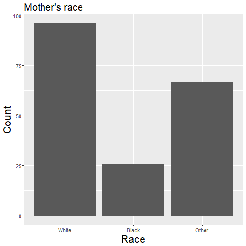


Single categorical variable
========================================================
transition:none

* <s>Pie chart</s> **Danger! Danger!**

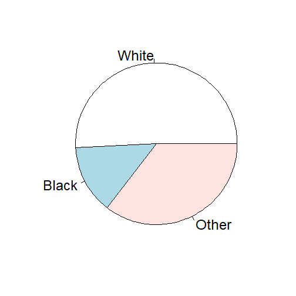


Single categorical variable
========================================================
transition:none

* Relative frequency table

<!-- html table generated in R 3.6.0 by xtable 1.8-4 package -->
<!-- Tue Jun 18 16:32:05 2019 -->
<table border=1>
<tr> <th> Race </th> <th> Count </th> <th> Percent </th>  </tr>
  <tr> <td> White </td> <td align="right">  96 </td> <td align="right"> 0.51 </td> </tr>
  <tr> <td> Black </td> <td align="right">  26 </td> <td align="right"> 0.14 </td> </tr>
  <tr> <td> Other </td> <td align="right">  67 </td> <td align="right"> 0.35 </td> </tr>
   </table>


Single categorical variable
========================================================
transition:none

<a href = "http://www.statschat.org.nz/wp-content/uploads/2015/06/devourThePie3.gif" target = "_blank">Click here to see how to improve a pie chart.</a>


Single categorical variable
========================================================
transition:none

* Why do pie charts suck?

> ["Pie Charts Are the Worst"](http://www.businessinsider.com/pie-charts-are-the-worst-2013-6)

> ["Countdown of Top 10 Reasons to Never Ever Use a Pie Chart"](https://blogs.oracle.com/experience/entry/countdown_of_top_10_reasons_to_never_ever_use_a_pie_chart)

> ["Save the Pies for Dessert"](http://www.perceptualedge.com/articles/visual_business_intelligence/save_the_pies_for_dessert.pdf)

* And to be fair, one guy who defends pie charts:

> ["Why Tufte is Flat-Out Wrong about Pie Charts"](http://speakingppt.com/2013/03/18/why-tufte-is-flat-out-wrong-about-pie-charts/)


Single quantitative variable
========================================================
transition:none


Single quantitative variable
========================================================
transition:none

Infant birth weight in grams


```
# A tibble: 189 x 1
     bwt
   <int>
 1  2523
 2  2551
 3  2557
 4  2594
 5  2600
 6  2622
 7  2637
 8  2637
 9  2663
10  2665
# ... with 179 more rows
```


Single quantitative variable
========================================================
transition:none

* Histogram

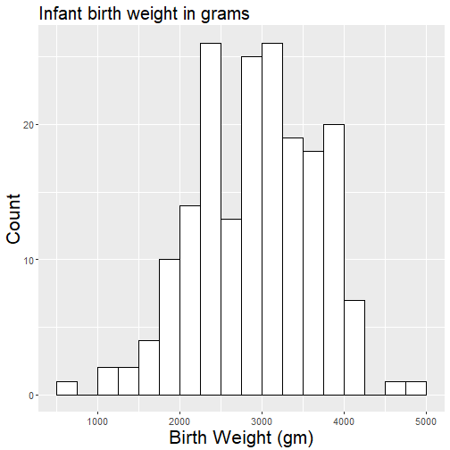


Single quantitative variable
========================================================
transition:none

* Tabular summaries

("Five-number summary" or other quantiles)

<table border=1>
<tr> <th>  </th> <th> Birth Weight (gm) </th>  </tr>
  <tr> <td align="right"> 0% </td> <td align="right"> 709 </td> </tr>
  <tr> <td align="right"> 5% </td> <td align="right"> 1801 </td> </tr>
  <tr> <td align="right"> 25% </td> <td align="right"> 2414 </td> </tr>
  <tr> <td align="right"> 50% </td> <td align="right"> 2977 </td> </tr>
  <tr> <td align="right"> 75% </td> <td align="right"> 3487 </td> </tr>
  <tr> <td align="right"> 95% </td> <td align="right"> 3997 </td> </tr>
  <tr> <td align="right"> 100% </td> <td align="right"> 4990 </td> </tr>
   </table>


Single quantitative variable
========================================================
transition:none

* A bunch of other types I don't prefer:

> boxplot, stem-and-leaf plot, dotplot


Multiple variables
========================================================
type: section

There are at least six elements of a plot that can be assigned to variables:

* x-axis (horizontal axis)
* y-axis (vertical axis)
* facets
* color/fill
* size
* shape (e.g., dots vs crosses, solid vs dashed lines, etc.)

Two categorical variables
========================================================


Two categorical variables
========================================================
transition: none

Mother's race and the number of previous premature labors.


```
# A tibble: 189 x 2
   race  ptl  
   <fct> <fct>
 1 Black 0    
 2 Other 0    
 3 White 0    
 4 White 0    
 5 White 0    
 6 Other 0    
 7 White 0    
 8 Other 0    
 9 White 0    
10 White 0    
# ... with 179 more rows
```


Two categorical variables
========================================================
transition: none
class: small-code

* Contingency table (okay)

<table border=1>
<tr> <th>  </th> <th> White </th> <th> Black </th> <th> Other </th>  </tr>
  <tr> <td align="right"> 0 </td> <td align="right"> 82 </td> <td align="right"> 22 </td> <td align="right"> 55 </td> </tr>
  <tr> <td align="right"> 1 </td> <td align="right"> 10 </td> <td align="right"> 4 </td> <td align="right"> 10 </td> </tr>
  <tr> <td align="right"> 2 </td> <td align="right"> 3 </td> <td align="right"> 0 </td> <td align="right"> 2 </td> </tr>
  <tr> <td align="right"> 3 </td> <td align="right"> 1 </td> <td align="right"> 0 </td> <td align="right"> 0 </td> </tr>
  <tr> <td align="right"> Total </td> <td align="right"> 96 </td> <td align="right"> 26 </td> <td align="right"> 67 </td> </tr>
   </table>


Two categorical variables
========================================================
transition: none
class: small-code

* Contingency table (better)

<table border=1>
<tr> <th>  </th> <th> White </th> <th> Black </th> <th> Other </th>  </tr>
  <tr> <td align="right"> 0 </td> <td align="right"> 85.42 </td> <td align="right"> 84.62 </td> <td align="right"> 82.09 </td> </tr>
  <tr> <td align="right"> 1 </td> <td align="right"> 10.42 </td> <td align="right"> 15.38 </td> <td align="right"> 14.93 </td> </tr>
  <tr> <td align="right"> 2 </td> <td align="right"> 3.12 </td> <td align="right"> 0.00 </td> <td align="right"> 2.99 </td> </tr>
  <tr> <td align="right"> 3 </td> <td align="right"> 1.04 </td> <td align="right"> 0.00 </td> <td align="right"> 0.00 </td> </tr>
  <tr> <td align="right"> Total </td> <td align="right"> 100.00 </td> <td align="right"> 100.00 </td> <td align="right"> 100.00 </td> </tr>
   </table>


Two categorical variables
========================================================
transition: none

* Side-by-side bar chart (okay)

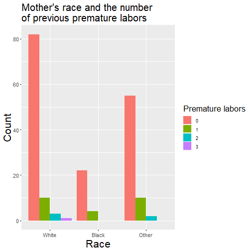


Two categorical variables
========================================================
transition: none

* Side-by-side bar chart (better)

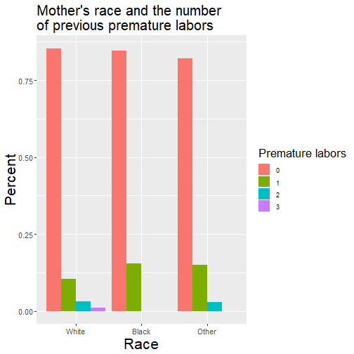


Two categorical variables
========================================================
transition: none

* <s>Stacked bar chart</s> **Danger! Danger!**

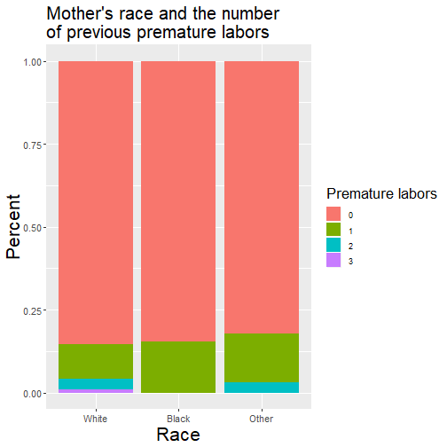


One categorical and one quantitative variable
========================================================


One categorical and one quantitative variable
========================================================
transition: none

Mother's race and infant birth weight in grams


```
# A tibble: 189 x 2
   race    bwt
   <fct> <int>
 1 Black  2523
 2 Other  2551
 3 White  2557
 4 White  2594
 5 White  2600
 6 Other  2622
 7 White  2637
 8 Other  2637
 9 White  2663
10 White  2665
# ... with 179 more rows
```


One categorical and one quantitative variable
========================================================
transition: none

* Side-by-side boxplot

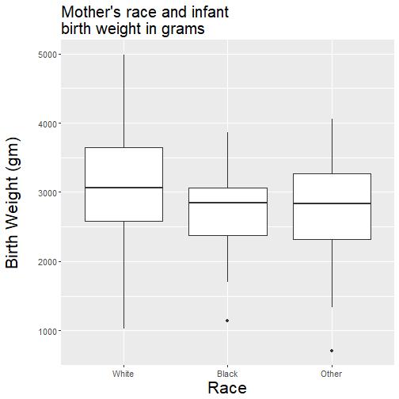


One categorical and one quantitative variable
========================================================
transition: none

* Stacked histogram (okay)

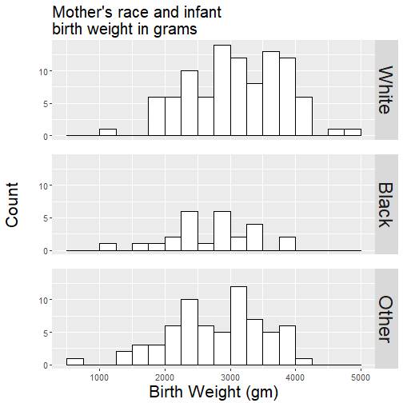


One categorical and one quantitative variable
========================================================
transition: none

* Stacked histogram (better)

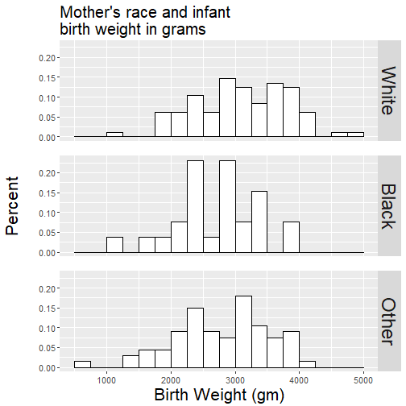


Two quantitative variables
========================================================


Two quantitative variables
========================================================
transition: none

Mother's age and infant birth weight


```
# A tibble: 189 x 2
     age   bwt
   <int> <int>
 1    19  2523
 2    33  2551
 3    20  2557
 4    21  2594
 5    18  2600
 6    21  2622
 7    22  2637
 8    17  2637
 9    29  2663
10    26  2665
# ... with 179 more rows
```


Two quantitative variables
========================================================
transition: none

* Scatterplot


Two quantitative variables
========================================================
transition: none

* If one variable is ordered (like time) and there is only one observation of y for each x value, use a lineplot.

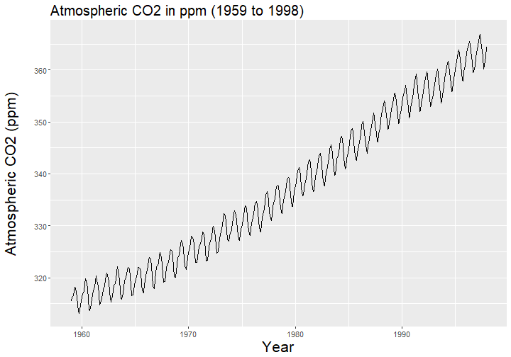

Three or more variables
========================================================

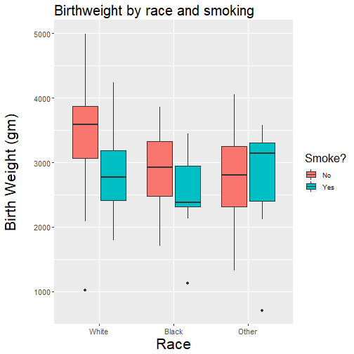


Three or more variables
========================================================
transition: none


