<style>
.small-code pre code {
  font-size: 1em;
}
</style>


Graph Types
========================================================
author: QUARC data visualization workshop


========================================================
type: section


Identifying variable types
========================================================
type: section

Identifying variable types
========================================================
transition: none

* Categorical (nominal, qualitative, factor)

Classifies data by category.

> color, species, sex

* Quantitative (numeric, scale, interval/ratio)

Numerical measurements, usually with meaningful units.

> height, GDP, score


Identifying variable types
========================================================
transition: none

**CAREFUL!**

Numbers are not always quantitative.

> *Do you own a car?*
>> 0 = "No", 1 = "Yes"

> *What is your zip code?*


Data set
========================================================
type: section

Risk factors associated with low infant birth weight, collected at Baystate Medical Center, Springfield, Mass during 1986.

189 women measured on 10 variables.


Single variable
========================================================
type: section

* Single variables usually won't answer very interesting questions by themselves.
* Graphs of single variables are often valuable for exploring your data, but generally not suitable for inclusion in the final product.


Single categorical variable
========================================================


Single categorical variable
========================================================
transition: none

Mother's race (white, black, or other)


```
# A tibble: 189 x 1
   race 
   <fct>
 1 Black
 2 Other
 3 White
 4 White
 5 White
 6 Other
 7 White
 8 Other
 9 White
10 White
# ... with 179 more rows
```

Single categorical variable
========================================================
transition: none

* Frequency table

<!-- html table generated in R 3.5.0 by xtable 1.8-2 package -->
<!-- Mon Jun 11 20:08:02 2018 -->
<table border=1>
<tr> <th> Race </th> <th> Count </th>  </tr>
  <tr> <td> White </td> <td align="right">  96 </td> </tr>
  <tr> <td> Black </td> <td align="right">  26 </td> </tr>
  <tr> <td> Other </td> <td align="right">  67 </td> </tr>
   </table>


Single categorical variable
========================================================
transition:none

* Bar chart

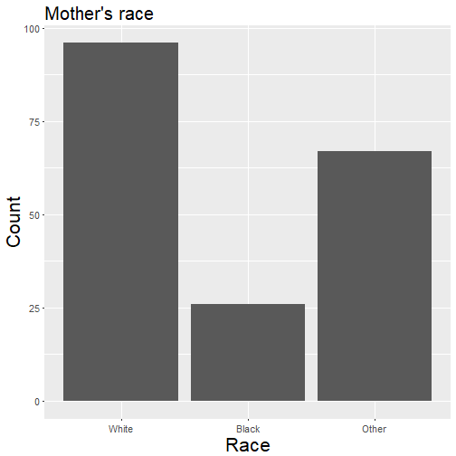


Single categorical variable
========================================================
transition:none

* <s>Pie chart</s> **Danger! Danger!**


Single categorical variable
========================================================
transition:none

* Relative frequency table

<!-- html table generated in R 3.5.0 by xtable 1.8-2 package -->
<!-- Mon Jun 11 20:08:02 2018 -->
<table border=1>
<tr> <th> Race </th> <th> Count </th> <th> Percent </th>  </tr>
  <tr> <td> White </td> <td align="right">  96 </td> <td align="right"> 0.51 </td> </tr>
  <tr> <td> Black </td> <td align="right">  26 </td> <td align="right"> 0.14 </td> </tr>
  <tr> <td> Other </td> <td align="right">  67 </td> <td align="right"> 0.35 </td> </tr>
   </table>


Single categorical variable
========================================================
transition:none

<a href = "http://www.statschat.org.nz/wp-content/uploads/2015/06/devourThePie3.gif" target = "_blank">Click here to see how to improve a pie chart.</a>


Single categorical variable
========================================================
transition:none

* Why do pie charts suck?

> ["Pie Charts Are the Worst"](http://www.businessinsider.com/pie-charts-are-the-worst-2013-6)

> ["Countdown of Top 10 Reasons to Never Ever Use a Pie Chart"](https://blogs.oracle.com/experience/entry/countdown_of_top_10_reasons_to_never_ever_use_a_pie_chart)

> ["Save the Pies for Dessert"](http://www.perceptualedge.com/articles/visual_business_intelligence/save_the_pies_for_dessert.pdf)

* And to be fair, one guy who defends pie charts:

> ["Why Tufte is Flat-Out Wrong about Pie Charts"](http://speakingppt.com/2013/03/18/why-tufte-is-flat-out-wrong-about-pie-charts/)


Single quantitative variable
========================================================
transition:none


Single quantitative variable
========================================================
transition:none

Infant birth weight in grams


```
# A tibble: 189 x 1
     bwt
   <int>
 1  2523
 2  2551
 3  2557
 4  2594
 5  2600
 6  2622
 7  2637
 8  2637
 9  2663
10  2665
# ... with 179 more rows
```


Single quantitative variable
========================================================
transition:none

* Histogram

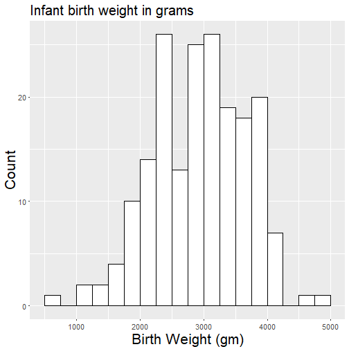


Single quantitative variable
========================================================
transition:none

* Tabular summaries

("Five-number summary" or other quantiles)

<table border=1>
<tr> <th>  </th> <th> Birth Weight (gm) </th>  </tr>
  <tr> <td align="right"> 0% </td> <td align="right"> 709 </td> </tr>
  <tr> <td align="right"> 5% </td> <td align="right"> 1801 </td> </tr>
  <tr> <td align="right"> 25% </td> <td align="right"> 2414 </td> </tr>
  <tr> <td align="right"> 50% </td> <td align="right"> 2977 </td> </tr>
  <tr> <td align="right"> 75% </td> <td align="right"> 3487 </td> </tr>
  <tr> <td align="right"> 95% </td> <td align="right"> 3997 </td> </tr>
  <tr> <td align="right"> 100% </td> <td align="right"> 4990 </td> </tr>
   </table>


Single quantitative variable
========================================================
transition:none

* A bunch of other types I don't prefer:

> boxplot, stem-and-leaf plot, dotplot


Multiple variables
========================================================
type: section

There are at least six elements of a plot that can be assigned to variables:

* x-axis (horizontal axis)
* y-axis (vertical axis)
* facets
* color/fill
* size
* shape (e.g., dots vs crosses, solid vs dashed lines, etc.)

Two categorical variables
========================================================


Two categorical variables
========================================================
transition: none

Mother's race and the number of previous premature labors.


```
# A tibble: 189 x 2
   race  ptl  
   <fct> <fct>
 1 Black 0    
 2 Other 0    
 3 White 0    
 4 White 0    
 5 White 0    
 6 Other 0    
 7 White 0    
 8 Other 0    
 9 White 0    
10 White 0    
# ... with 179 more rows
```


Two categorical variables
========================================================
transition: none
class: small-code

* Contingency table (okay)

<table border=1>
<tr> <th>  </th> <th> White </th> <th> Black </th> <th> Other </th>  </tr>
  <tr> <td align="right"> 0 </td> <td align="right"> 82 </td> <td align="right"> 22 </td> <td align="right"> 55 </td> </tr>
  <tr> <td align="right"> 1 </td> <td align="right"> 10 </td> <td align="right"> 4 </td> <td align="right"> 10 </td> </tr>
  <tr> <td align="right"> 2 </td> <td align="right"> 3 </td> <td align="right"> 0 </td> <td align="right"> 2 </td> </tr>
  <tr> <td align="right"> 3 </td> <td align="right"> 1 </td> <td align="right"> 0 </td> <td align="right"> 0 </td> </tr>
  <tr> <td align="right"> Total </td> <td align="right"> 96 </td> <td align="right"> 26 </td> <td align="right"> 67 </td> </tr>
   </table>


Two categorical variables
========================================================
transition: none
class: small-code

* Contingency table (better)

<table border=1>
<tr> <th>  </th> <th> White </th> <th> Black </th> <th> Other </th>  </tr>
  <tr> <td align="right"> 0 </td> <td align="right"> 85.42 </td> <td align="right"> 84.62 </td> <td align="right"> 82.09 </td> </tr>
  <tr> <td align="right"> 1 </td> <td align="right"> 10.42 </td> <td align="right"> 15.38 </td> <td align="right"> 14.93 </td> </tr>
  <tr> <td align="right"> 2 </td> <td align="right"> 3.12 </td> <td align="right"> 0.00 </td> <td align="right"> 2.99 </td> </tr>
  <tr> <td align="right"> 3 </td> <td align="right"> 1.04 </td> <td align="right"> 0.00 </td> <td align="right"> 0.00 </td> </tr>
  <tr> <td align="right"> Total </td> <td align="right"> 100.00 </td> <td align="right"> 100.00 </td> <td align="right"> 100.00 </td> </tr>
   </table>


Two categorical variables
========================================================
transition: none

* Side-by-side bar chart (okay)

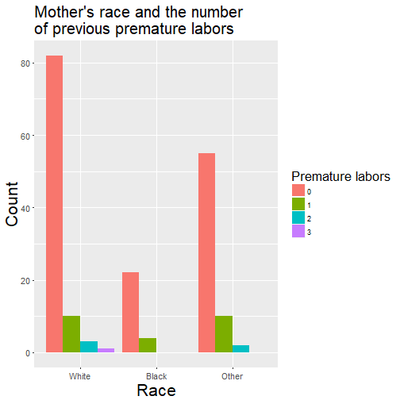


Two categorical variables
========================================================
transition: none

* Side-by-side bar chart (better)

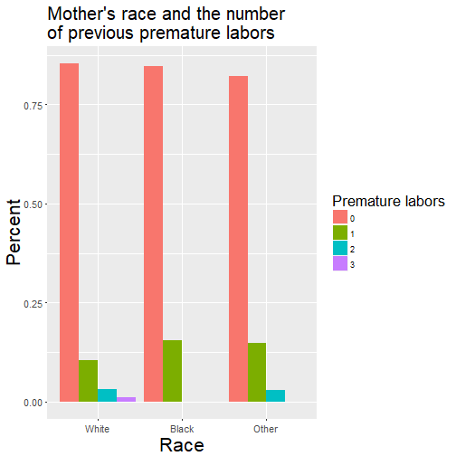


Two categorical variables
========================================================
transition: none

* <s>Stacked bar chart</s> **Danger! Danger!**

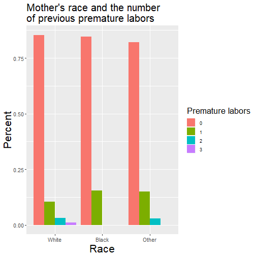


One categorical and one quantitative variable
========================================================


One categorical and one quantitative variable
========================================================
transition: none

Mother's race and infant birth weight in grams


```
# A tibble: 189 x 2
   race    bwt
   <fct> <int>
 1 Black  2523
 2 Other  2551
 3 White  2557
 4 White  2594
 5 White  2600
 6 Other  2622
 7 White  2637
 8 Other  2637
 9 White  2663
10 White  2665
# ... with 179 more rows
```


One categorical and one quantitative variable
========================================================
transition: none

* Side-by-side boxplot

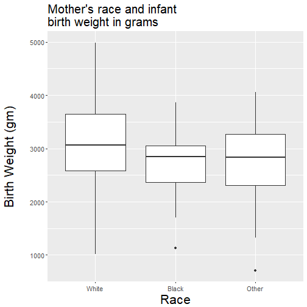


One categorical and one quantitative variable
========================================================
transition: none

* Stacked histogram (okay)

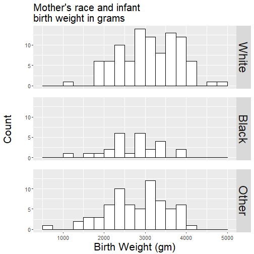


One categorical and one quantitative variable
========================================================
transition: none

* Stacked histogram (better)


Two quantitative variables
========================================================


Two quantitative variables
========================================================
transition: none

Mother's age and infant birth weight


```
# A tibble: 189 x 2
     age   bwt
   <int> <int>
 1    19  2523
 2    33  2551
 3    20  2557
 4    21  2594
 5    18  2600
 6    21  2622
 7    22  2637
 8    17  2637
 9    29  2663
10    26  2665
# ... with 179 more rows
```


Two quantitative variables
========================================================
transition: none

* Scatterplot

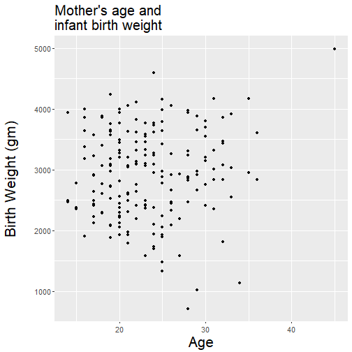


Two quantitative variables
========================================================
transition: none

* If one variable is ordered (like time) and there is only one observation of y for each x value, use a lineplot.

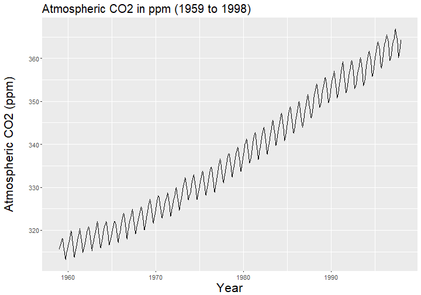

Three or more variables
========================================================

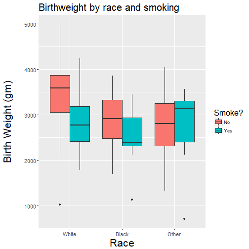


Three or more variables
========================================================
transition: none

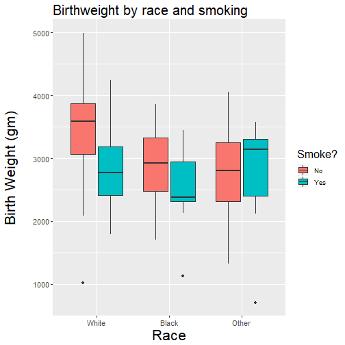
